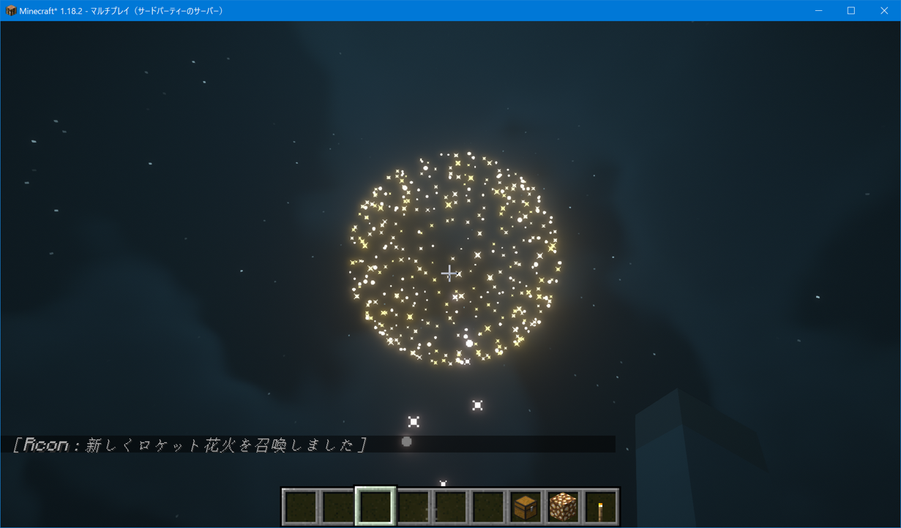

# MinecraftConnection
<div>

</div>


[](https://circleci.com/gh/takunology/MinecraftConnection/tree/main)

日本語版は[こちら](https://github.com/takunology/MinecraftConnection/blob/main/README_JP.md)

This library is based on CoreRCON and extended for Minecraft that uses the C# language to enable Minecraft programming by sending commands to Minecraft. RCON connections are asynchronous, but this library allows users to use asynchronous methods without declaring them. When you create and run a program using this library, you need to start a minecraft server with RCON connection configured.

# 1. Preparation
First, download the Minecraft Server software and run it in any game directory. A server configuration file called `server.properties` will be created. Specify the password and port number for the RCON connection, and enable the connection.

Configuration example :

```
rcon.port=25575
rcon.password=minecraft
enable-rcon=true
```

After adding it save the file and restart the server.   Launch Minecraft launcher and log in to the server. </br>

# 2. Create Project
This library is intended for `.NET Standard 2.0` and above. This section describes how to create a .NET 5 console application. 

Install `MinecraftConnection` with the NuGet package manager, or run the following command in the package manager console. (This is currently a pre-release version.)

```
Install-Package MinecraftConnection -Version 1.0.0-beta1
```

Detail：https://www.nuget.org/packages/MinecraftConnection
</br>

# 3. Sample programs
To run the program, start Minecraft Server and Minecraft itself (already logged in to the server). 

Set the time to 0 :

```cs
using System.Net;
using MinecraftConnection;

namespace ExampleApp
{
    class Program
    {
        private static readonly IPAddress _address = IPAddress.Parse("127.0.0.1");
        private static readonly ushort _port = 25575;
        private static readonly string _pass = "minecraft";
        private static MinecraftCommands command = new MinecraftCommands(_address, _port, _pass);

        static void Main(string[] args)
        {
            command.SendCommand("/time set 0");
        }
    }
}
```
</br>
Set off fireworks :

```cs
using System.Net;
using MinecraftConnection;
using MinecraftConnection.Items;

namespace ExampleApp
{
    class Program
    {
        private static readonly IPAddress _address = IPAddress.Parse("127.0.0.1");
        private static readonly ushort _port = 25575;
        private static readonly string _pass = "minecraft";
        private static MinecraftCommands command = new MinecraftCommands(_address, _port, _pass);

        static void Main(string[] args)
        {
            string playerName = "takunology";
            // Get player coordinates
            var playerData = command.GetPlayerData(playerName);
            int x = playerData.PositionX;
            int y = playerData.PositionY;
            int z = playerData.PositionZ;
            // Set Fireworks colors
            List<FireworksColors> explosionColor = new List<FireworksColors>() { FireworksColors.BLUE };
            List<FireworksColors> fadeColor = new List<FireworksColors>() { FireworksColors.CYAN };
            // Make the fireworks item
            Fireworks fireworks = new Fireworks(20, 2, FireworksShapes.LargeBall, false, true, explosionColor, fadeColor);
            // Set off fireworks
            command.SetOffFireworks(x + 10, y, z, fireworks);
        }
    }
}
```

Result :



</br>

Project Detail: https://www.mcwithcode.com/
